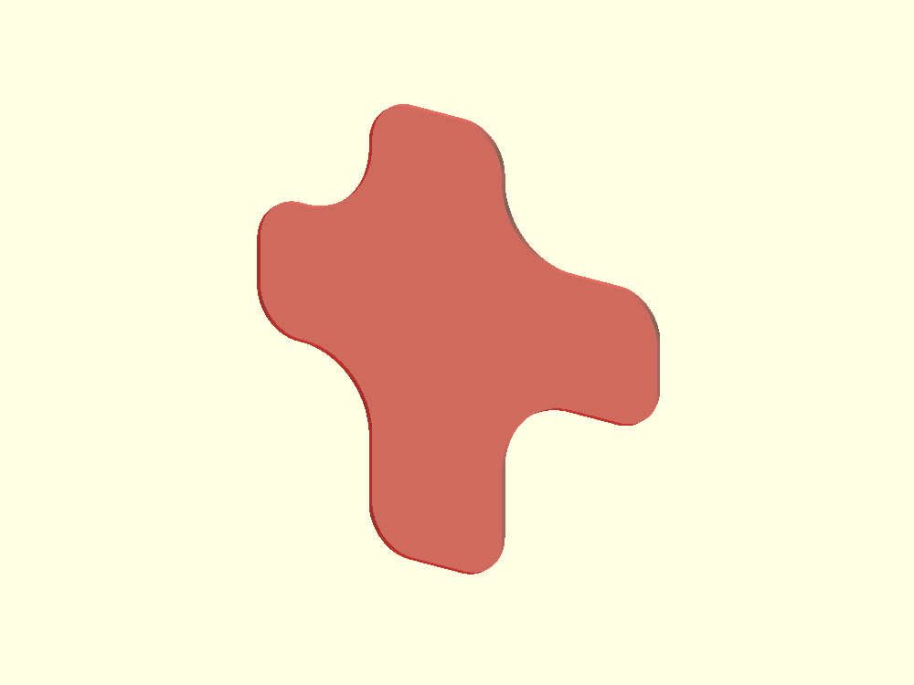
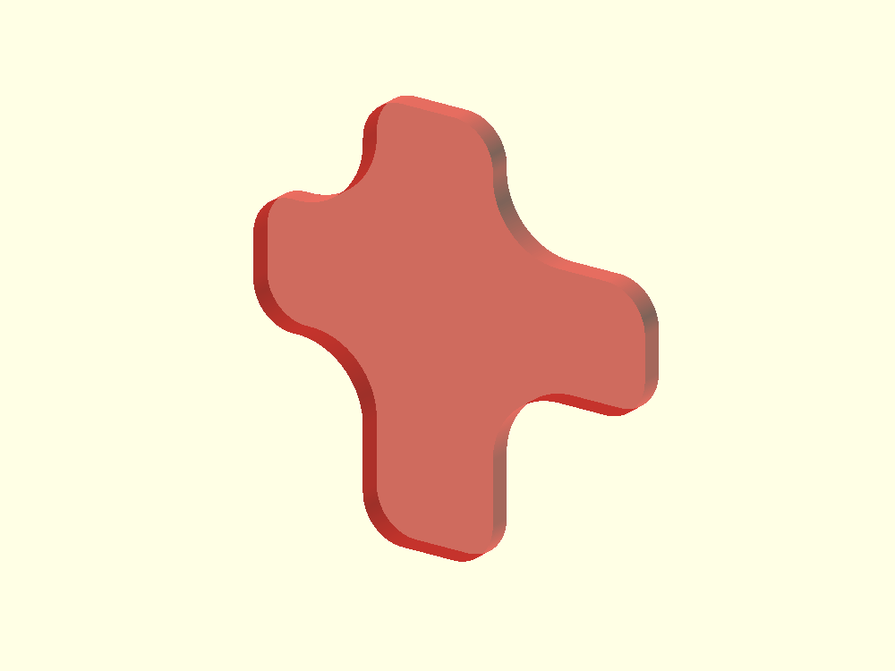
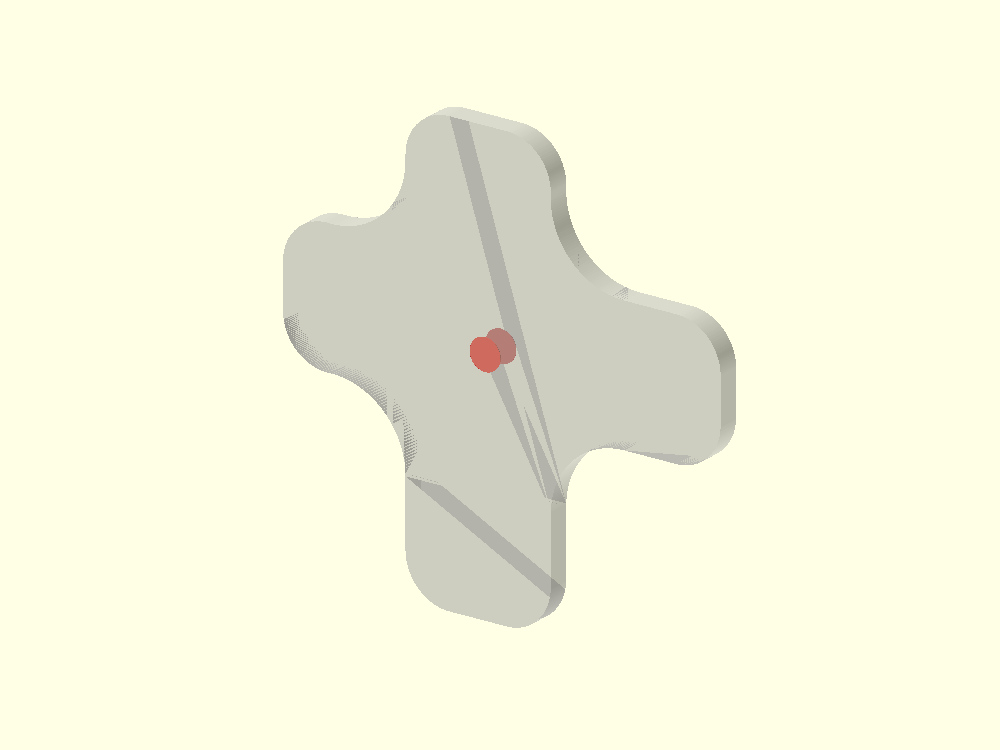
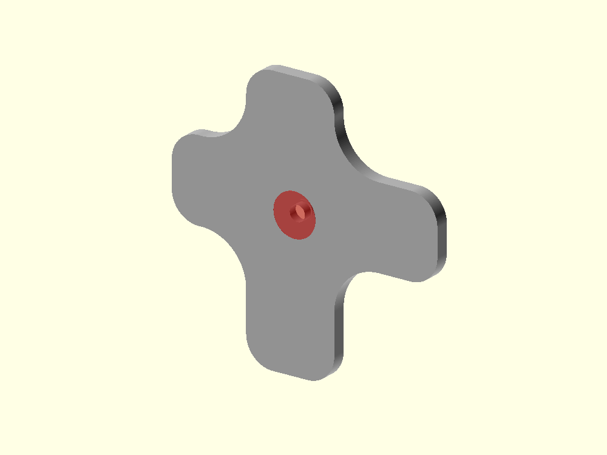
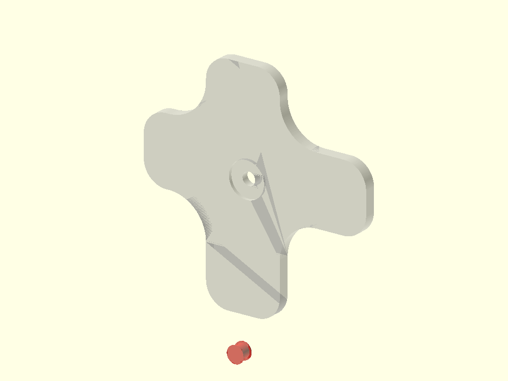
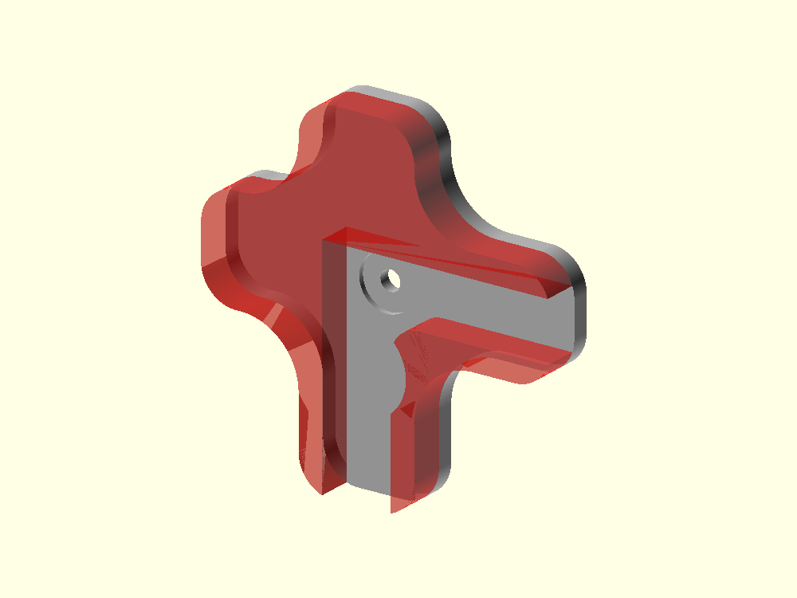
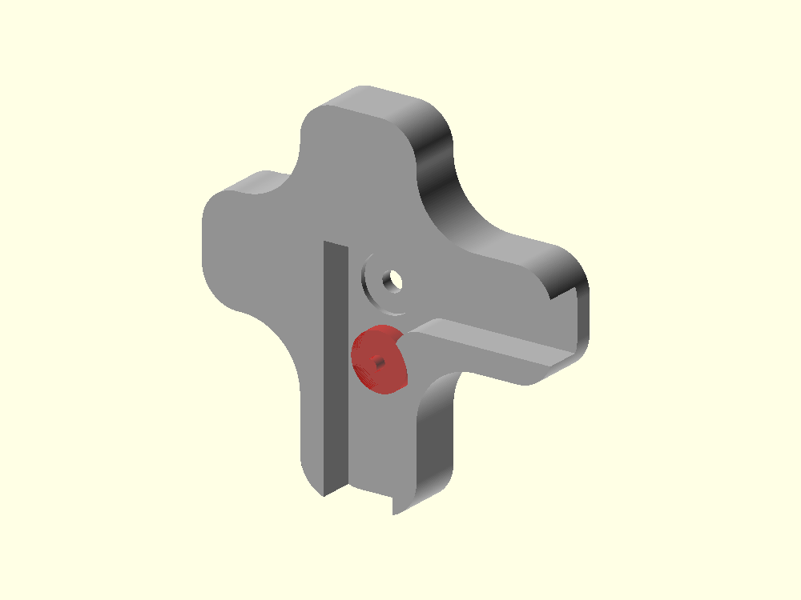
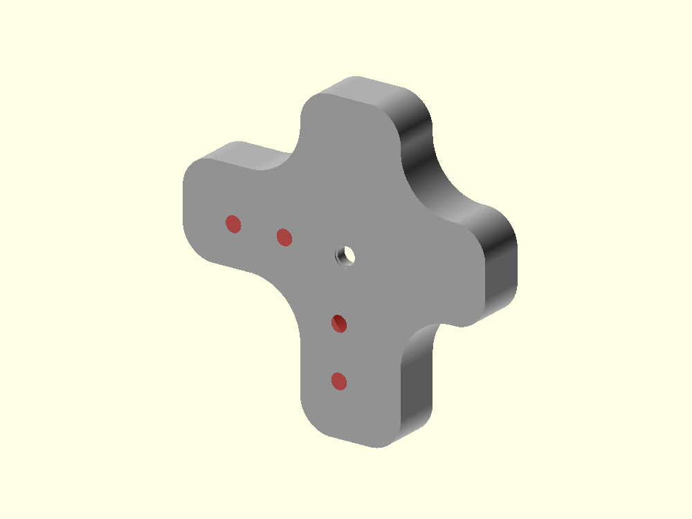
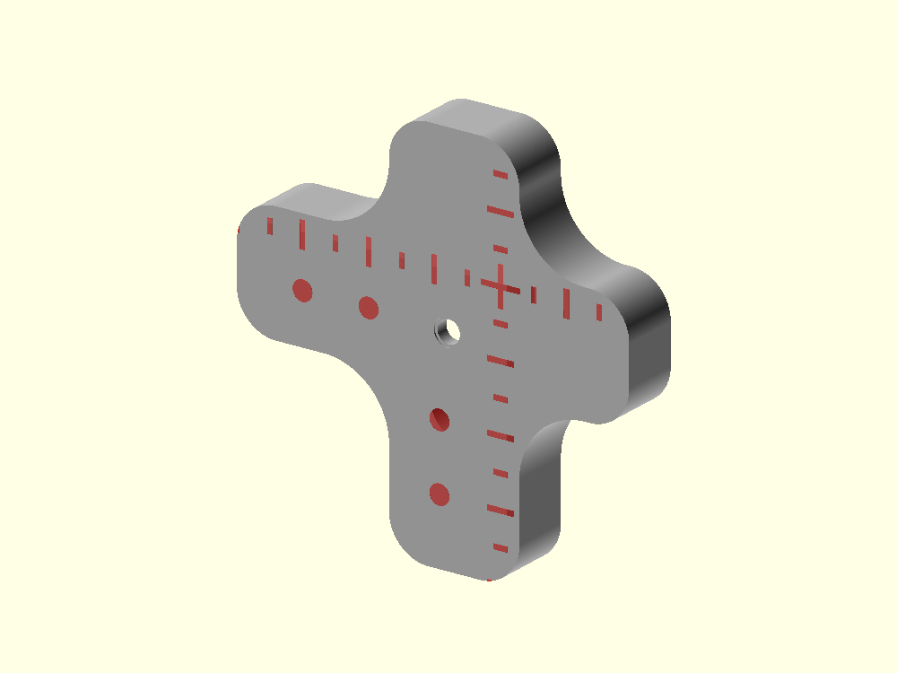
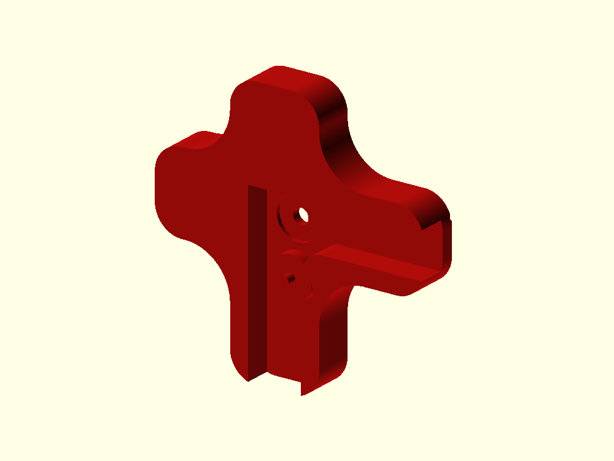

# HUB75 corner-edge coupler — design


## Physical purpose

The corner-edge coupler supports one outside corner of a portrait HUB75 panel.

There are only **two printable corner variants**:

```text
left
    top-left
    rotate 180 degrees -> bottom-right

right
    top-right
    rotate 180 degrees -> bottom-left
```

This works because the HUB75 panel's two Ø3 locating pins are diagonal:
top-left and bottom-right contain the same locator-pin relationship after a
180 degree rotation, while top-right and bottom-left contain none.

The first implementation intentionally contains **no aluminium-tube clip**.
The corner body and panel fit are established before reinforcement hardware is
added.

## Coordinate system

The corner component does not use the screw as its origin.

```text
X = 0
Z = 0
    nominal 160 x 320 mm panel corner

Y = 0
    HUB75 rear mounting plane
```

For the left part, +X points inward across the panel. For the right part, -X
points inward. In both top variants, -Z points inward.

This makes the engraved `+` a true panel-envelope datum and keeps the 5/10 mm
reference ticks meaningful across small, medium and large.

## Family dimensions

The corner keeps the same named size presets as the middle and horizontal-edge
couplers:

```text
small    profile 60 mm   wall 2 mm   guide 4 mm   base 2 mm
medium   profile 80 mm   wall 4 mm   guide 6 mm   base 3 mm
large   profile 100 mm   wall 6 mm   guide 10 mm  base 4 mm
```

The inward arm reach is half the profile size. The two short outside arms stop
at **19.5 mm from the nominal panel corner**, keeping the project-wide outside
projection below 20 mm.

## 1. Rounded asymmetric corner profile

The physical rear side rail and top end rail do not lie exactly on the nominal
160 x 320 mm envelope. The printable cross therefore follows the real rail
centre lines while its overall bounds remain referenced to the nominal corner.

The medium panel-derived rail centres are approximately:

```text
left side rail X = +7.024 mm
right side rail X = -7.024 mm
top end rail Z = -6.144 mm
```

The base profile uses the same R10 concave corners and R6 free ends as the
connector family, but its four arm lengths are asymmetric:

```text
inward X/Z reach = profile_size / 2
outside X/Z reach = 19.5 mm
```



## 2. Base

The rounded 2D profile is extruded behind the panel mounting plane.



## 3. Corner screw

The nominal-corner coordinate system makes the actual mounting screw location
especially easy to inspect:

```text
left  top screw = [ +8, -8 ] mm
right top screw = [ -8, -8 ] mm
```

The Ø3.4 through bore keeps the same 0.20 mm anti-elephant-foot relief with
0.40 mm radial widening used by the other couplers.



## 4. Mounting-tube pocket

The physical Ø8.5 mounting tube projects through the rear mounting plane.
A shallow blind pocket clears that tube without weakening the complete base.



## 5. Diagonal locator-pin clearance

Only the **left** top-corner variant overlaps a physical Ø3 locating pin.

In nominal-corner coordinates its centre is:

```text
[ +5, -50 ] mm
```

This is outside the small and medium body reaches. It touches the 100 mm large
profile at the inward free end, so only the large left part receives a visible
partial clearance there.

Rotating the left part 180 degrees transfers that same clearance to the physical
bottom-right locator pin. The right/bottom-left part needs no locator clearance.



## 6. Fitted corner guide

The guide is derived from the **actual panel material** at the rear corner:

1. start with the physical rear panel quadrant;
2. subtract the rounded rear opening;
3. apply the configured print clearance;
4. subtract that keep-out from the printable corner profile.

The fitted guide continues across the two physical outside edges at the same
family `guide_height`: 4 mm for small, 6 mm for medium and 10 mm for large.
The outside portions are kept straight in this first milestone; only a future
taper is deferred.

The guide end mask is an intersection only: it can trim a free end but can
never expand or erode the thin 2 mm small-profile wall.



## 7. Reinforcement locator

Each physical panel corner has one separate reinforcement circle 11 mm inward
from the corner mounting screw.

The corner uses the same family locator dimensions:

```text
pad  Ø9.4 mm
pin  Ø2.1 mm
```

The surrounding guide is relieved around the Ø14 reinforcement footprint.



## 8. Reference pockets

The same decorative/visual reference pockets are retained:

```text
visible diameter        Ø3 mm
maximum blind depth      2 mm
small effective depth  1.3 mm
final taper             0.5 mm
bottom diameter          Ø2 mm
minimum back wall       0.7 mm
```

The raster is first constructed around a symmetric virtual corner cross. The
real asymmetric profile then clips unsupported rows. This exposes the
difference between nominal panel edges and physical rear rails instead of
hiding it.



## 9. Corner and distance marks

The `+` is exactly the nominal panel corner. Minor ticks are spaced every
5 mm and the longer ticks mark full centimetres.

Unlike a generic decorative engraving, the marks continue in both inward and
outside directions and are clipped only by the real corner profile. They are
therefore a direct visual check of the 19.5 mm outside limit and the selected
30/40/50 mm inward reach.



## 10. Complete left corner



## Right variant

The right part is the X-mirrored mechanical counterpart. It uses the same
dimensions, panel fit and surface language, but its side-rail centre and screw
position are mirrored and it has no top-corner locator-pin clearance.

A 180 degree rotation maps:

```text
left  -> bottom-right
right -> bottom-left
```

No separate top/bottom geometry is required.

## Deferred

The aluminium tube, corner C-clip and final outer-ridge taper remain
intentionally deferred. Once the left/right corner body is digitally and
physically accepted, the reinforcement system can be added to the already
verified connector family.
