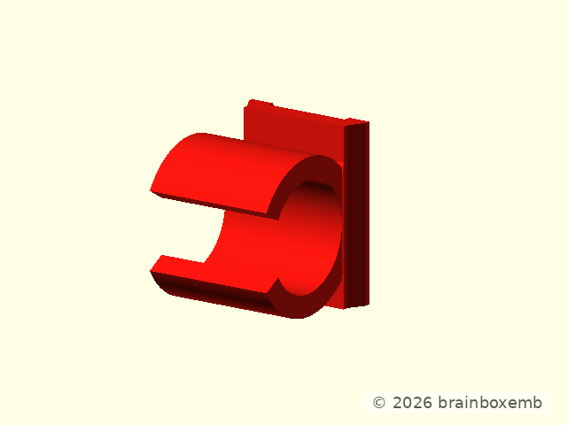
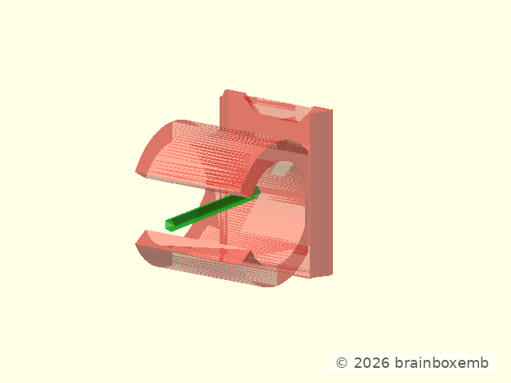
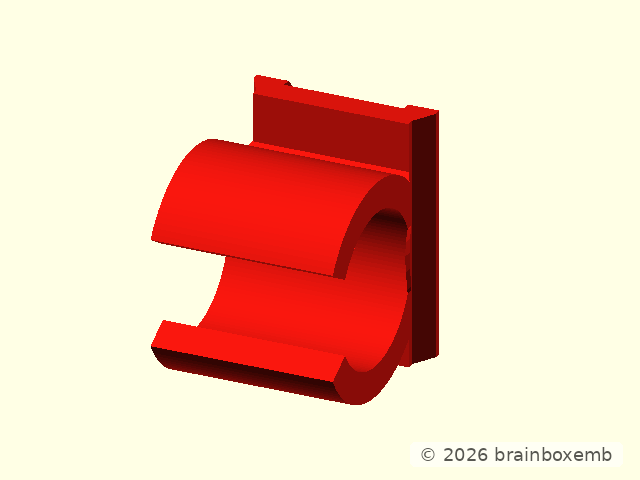
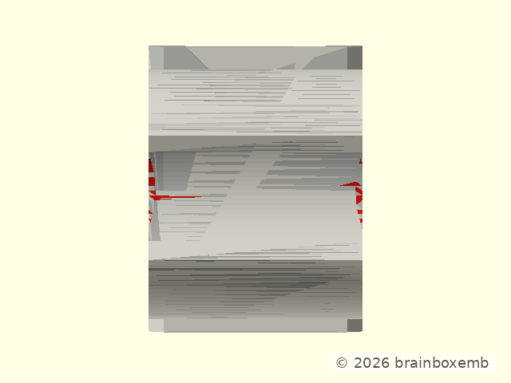

# HUB75 tube clamp — design


## Purpose of this document

This document is the geometric source of truth for the **project-owned HUB75
tube clamp adapter**.

The reusable snap clip itself already has a worked-out design in
`lib.scad.clamps/openscad/tube-clamp/design/design.md`. The missing piece was
the HUB75-specific adapter that combines that reusable clip with the
size-matched sliding dovetail.

That omission made later changes unnecessarily expensive: the coordinate
transform, print orientation, ownership boundary and construction order had to
be reconstructed from the OpenSCAD code during every small correction.

The rule from this point onward is:

> do not reshape the accepted base clamp while solving a local HUB75 adapter
> detail.

The pre-relief baseline below is the shape to preserve except for the small
local side relief accepted later in this document.



## Ownership boundary

Three layers participate in this component.

### `lib.scad.clamps`

Owns the reusable tube clip:

- circular outside;
- functional/tension bore semantics;
- snap opening;
- compact flat base;
- compact transition from that base into the ring.

HUB75 must not silently redesign that geometry.

### `lib.scad.mechint`

Owns the reusable sliding-dovetail profile:

- 30 degree flank;
- mouth/root lands;
- fit and axial clearance;
- entry travel;
- lock/release geometry;
- generic male relief cutter.

### HUB75 project component

`hub75_tube_clamp.scad` owns only the adaptation between those two reusable
components:

- project coordinate transform;
- fixed tube datum;
- size/profile selection;
- compact clamp-to-dovetail overlap;
- the project-local finishing transition;
- any small print-driven relief that cannot sensibly live in either library.

## Project orientation

The HUB75 **project orientation** is:

```text
X = aluminium tube axis
Y = panel front -> rear
Z = display-edge outward / dovetail insertion direction
```

The reusable clamp has its own **design orientation**. The production transform maps:

```text
lib clamp Z  -> project X
lib clamp X  -> project -Y
lib clamp Y  -> project -Z
```

That transform is not just an implementation detail. It determines which way a
subtraction is oriented physically.

## Lab and print orientation

The clamp is still **side-printed**. In that print orientation the 12 mm clamp
side is placed on the bed, so:

```text
project X / tube axis = printer Z / build direction
```

The local relief is defined in the component lab's **lab orientation**, because that is the frame in which its position was visually calibrated:

```text
project X -> lab X
project Y -> lab -Z
project Z -> lab Y
```

So `d_relief_z_height_mm` and `d_relief_z_offset_mm` refer specifically to
**lab Z**. They do not refer to dovetail height and they do not move
when small / medium / large is selected.

The green reference axis below shows lab Z. It is documentation-only.



## Male lock-release print wedges

The detachable clip uses the released `lib.scad.mechint v0.1.6` male
lock-release opening.

The functional rectangular release opening remains unchanged. HUB75 selects
the optional printable form:

```text
lock_release_shape = "trapezoid"
lock_release_taper_angle_deg = 45
```

The library implements this as **additional subtraction**, not as a narrower
replacement opening. Two symmetric triangular X/Z wedges are removed over the
complete visible release zone, including the recess. The wedges widen only
toward the male outer/trailing edge; at the lock recess the original functional
release width is still present in full.

For this component's mapping, mechint design X/Z becomes the X/Z plane seen in
the actual side-print orientation. The 45 degree wedge therefore replaces the
flat overhang with a printable slope on both sides. Mechint design-Y release depth stays
constant.

The wedge cutters also extend slightly beyond the male outer face and overlap
the baseline release cutter by the normal Boolean allowance. This is deliberate:
it prevents a coplanar boundary from leaving a thin residual wall at the
opening.

This geometry was qualified on the complete baseline clip in
`2026-009-02.cad.hub75-component-lab` before being released by
`lib.scad.mechint`.

## Fixed tube and clamp dimensions

All sizes retain the same actual tube clip:

```text
tube functional diameter   = 10.0 mm
tube tension diameter      =  9.6 mm
wall thickness             =  2.0 mm
clamp width                = 12.0 mm
functional outside diameter = 14.0 mm
tension outside diameter    = 13.6 mm
```

The tube datum also remains fixed. Selecting small / medium / large must not
move or resize the circular snap ring.

The size-dependent part is the interface toward the coupler.

## Size mapping

The selected coupler d_profile and clamp interface belong together.

| Coupler d_profile | Host depth | Dovetail height | Clamp body transition |
| --- | ---: | ---: | --- |
| small | 2.0 mm | 2.0 mm | fixed accepted baseline |
| medium | 3.0 mm | 2.5 mm | fixed accepted baseline |
| large | 4.0 mm | 3.0 mm | fixed accepted baseline |

Only the **dovetail interface height** changes with the selected coupler profile.
The receiving coupler material becomes correspondingly deeper/higher, but the
tube clip body itself must not be reshaped just because the dovetail height
changed.

The accepted clamp-body transition is therefore fixed across small / medium /
large. Its current baseline is the previously accepted medium connection:
approximately 10.27 mm transition width and 1.5 mm transition depth for the
normal 12 mm clamp width.

### Why the earlier size-dependent transition looked logical

The earlier implementation was not arbitrary. The dovetail root width stays
12 mm, but its **height** changes while the flank angle remains 30 degrees and
both straight lands remain 0.5 mm.

That means a taller dovetail also has a narrower mouth:

```text
mouth width
= 12
  - 2 × (dovetail height - 0.5 - 0.5) × tan(30°)
```

For the three profiles this gives approximately:

| Profile | Dovetail height | Dovetail mouth width |
| --- | ---: | ---: |
| small | 2.0 mm | 10.85 mm |
| medium | 2.5 mm | 10.27 mm |
| large | 3.0 mm | 9.69 mm |

If the clamp transition is then required to meet that mouth exactly while also
following the same 30 degree side angle, its depth must grow as the mouth moves
inward:

```text
transition depth
= ((12 - mouth width) / 2) / tan(30°)
```

which gives 1.0 / 1.5 / 2.0 mm.

So the previous behaviour had a clear geometric reason:

```text
taller dovetail
    -> narrower mouth
    -> farther inward from the 12 mm clamp face
    -> more transition depth needed to reach it at 30°
```

### Current decision: keep the clamp body fixed

For the current design we deliberately do **not** let that relationship reshape
the clamp body automatically.

The design intent is that changing coupler d_profile changes the available host
depth and therefore the dovetail height. The coupler/female side gets the extra
material needed for that deeper interface. The reusable tube-clip body remains
the same accepted shape.

The actual male dovetail d_profile and the local material relief needed so that
d_profile can enter its female channel may still differ by size. Those are
interface changes; they are not automatically clamp-body changes.

This is a design choice, not a claim that the earlier derived transition was
geometrically wrong. It may be reconsidered later if there is a good reason to
make the clamp transition track the active dovetail mouth again—for example
load transfer, a cleaner interface blend or print behaviour. If reconsidered,
compare small / medium / large side-by-side and treat the resulting silhouette
change as an explicit design decision rather than an incidental consequence of
the dovetail-height formula.

The interactive `tube-clamp` and `tube-clamp-dov` views must use the selected
`d_coupler_profile`. A custom profile derives the interface from its configured
`d_base_thickness_mm`.

## Construction order

The production component is built in this order:

```text
1. create reusable lib.scad.clamps body
2. transform it into HUB75 project coordinates
3. trim consumer material with mechint male-relief cutter
4. apply the existing local 30 degree finishing wedge
5. union the size-matched male dovetail
6. only then consider a tiny local print relief if required
```

Step 6 is deliberately last. A print-relief correction must not be allowed to
turn into a new global clamp profile.

## Accepted baseline

The complete clamp below is the accepted base form for the current correction.

It may have one visually sharp local edge near the clamp/dovetail transition.
That local edge is the problem; the overall silhouette is not.

The following are **not** acceptable ways to solve that edge:

- narrowing the whole clamp into an hourglass;
- cutting a broad cylindrical scoop through the ring;
- introducing a rectangular step/notch;
- changing the 30 degree dovetail transition globally;



## Local side relief

The component-lab experiment established a small round relief on **both physical
clamp sides**. It is intentionally local: the accepted ring, snap opening,
fixed clamp-body transition and dovetail silhouette remain unchanged away from
the relief.

The accepted defaults are:

```text
radius          = 6.0 mm
bite            = 0.4 mm
lab-Z height = 4.0 mm
lab-Z offset = 1.0 mm
```

The side position is derived rather than hard-coded. With the 12 mm clamp width:

```text
abs(lab X)
= clamp_width / 2 + radius - bite
= 6 + 6 - 0.4
= 11.6 mm
```

So each R6 cutter centre is 5.6 mm outside its clamp side and enters the model
by only 0.4 mm.

The other transverse coordinate is the fixed tube datum:

```text
lab Y = tube_center_z
```

Lab-Z starts from the clamp body's own transition geometry and then
adds the explicit offset:

```text
ring_center_x = base_thickness + functional_outer_radius

attach_x = min(
    base_thickness + transition_depth,
    ring_center_x + functional_outer_radius - extra
)

development relief position
= body-derived position + d_relief_z_offset_mm
```

The important semantic split is:

- `d_relief_z_height_mm` controls the **length of the low cylinder along
  lab Z**;
- `d_relief_z_offset_mm` moves that complete cutter along lab Z without
  changing its height.

Because the clamp-body transition is fixed across small / medium / large, this
offset is independent of dovetail d_profile height.

Translated back to the reusable clamp's design coordinates, the accepted
lab-Z cylinders become short cylinders along **clamp design X**. Their circular
centres sit just outside the two **clamp design Z** side faces. Production uses that
equivalent construction directly.

This is deliberately different from the previous lower-transition-foot
experiment. The previous R10 / 1 mm / shallow-face cutter targeted the wrong
local geometry and is no longer part of the design.

The red geometry below shows only the material removed by the accepted side
reliefs.



The resulting complete clamp is:


## Validation checklist

A candidate local relief is valid only when all of the following are true:

1. the baseline silhouette is still recognizable immediately;
2. the same small round relief appears on both physical clamp sides;
3. the default geometry remains R6 / 0.4 mm bite / 4 mm lab-Z height /
   1 mm lab-Z offset;
4. changing small / medium / large does not move the relief merely because
   dovetail height changed;
5. the fixed clamp-body transition remains identical across the three profiles;
6. `lib.scad.clamps v0.1.8` keeps 2.0 mm wall thickness in both functional and
   tension geometry while keeping the nominal tube centre fixed;
7. generated STL remains manifold;
8. the close-up render makes the before/after change obvious without needing to
   reconstruct coordinate transforms from source code.

## Production files

Implementation:

```text
hub75_tube_clamp.scad
```

Opening this file directly in OpenSCAD exposes a small standalone Customizer
for the normal component controls:

```text
d_profile
c_view
d_bore
d_apply_transition_relief
d_relief_radius_mm
d_relief_bite_mm
d_relief_z_height_mm
d_relief_z_offset_mm
c_resolution
```

The standalone controls follow the shared SCAD naming convention from
`brainboxemb.meta/domains/scad/coding-conventions.md`.

- `d_` marks design/functional input, even when it appears in the Customizer;
- `c_` marks presentation/inspection-only Customizer state;
- physical scalar inputs include an explicit unit suffix such as `_mm`;
- private implementation names use a leading underscore.

The internal object created by this entrypoint is named
`_standalone_clamp` to make that boundary explicit.

Consumers normally import the production API with `use <...>`; the standalone
top-level entrypoint is then not executed.

Design-render adapter:

```text
hub75_tube_clamp_render.scad
```

Use the render adapter for standalone design inspection and documentation views.

Reusable base-clip design:

```text
lib.scad.clamps/openscad/tube-clamp/design/design.md
```

Reusable sliding-dovetail public API:

```text
lib.scad.mechint/openscad/sliding_dovetail.scad
```

Its companion design/reference/render workspace is:

```text
lib.scad.mechint/openscad/sliding-dovetail/
```
