# PNG renders

This gallery is generated automatically from the PNG output in this build snapshot.
Do not edit it manually.

## Corner Edge Coupler Left Large

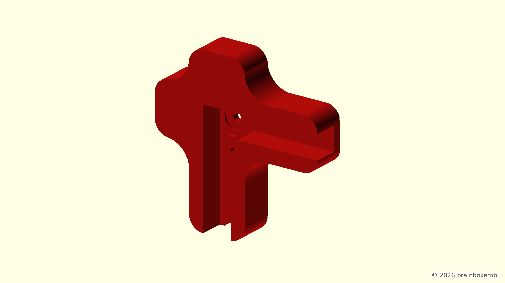

## Corner Edge Coupler Left Medium

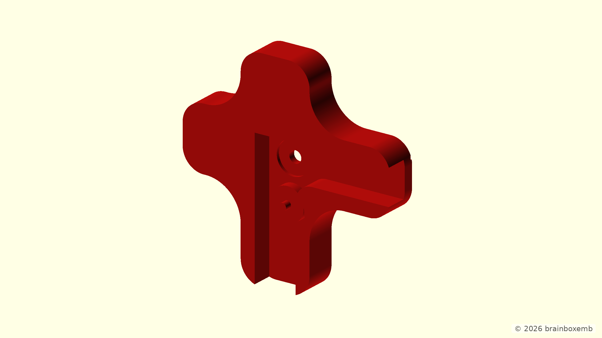

## Corner Edge Coupler Left Small

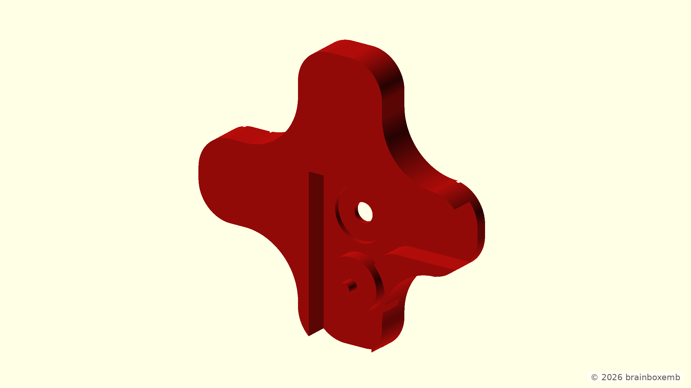

## Corner Edge Coupler Right Large

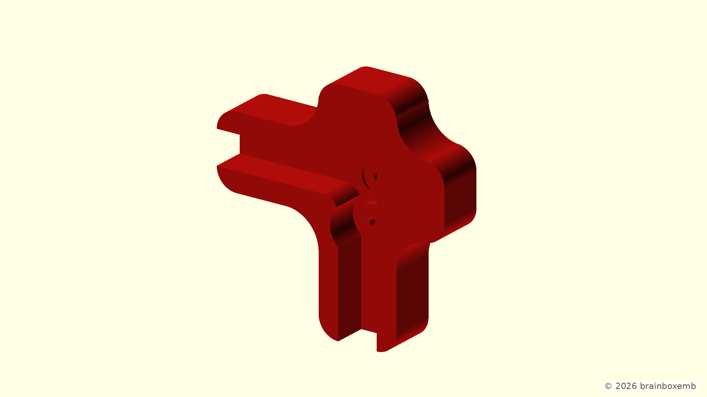

## Corner Edge Coupler Right Medium

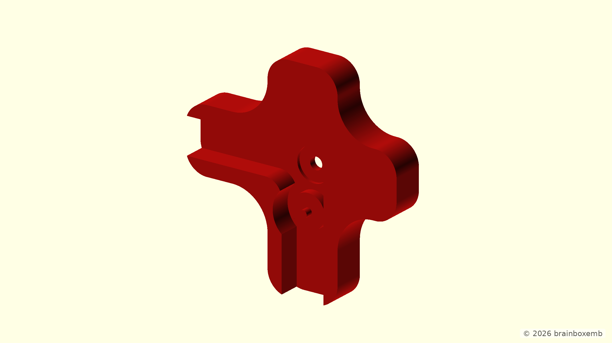

## Corner Edge Coupler Right Small

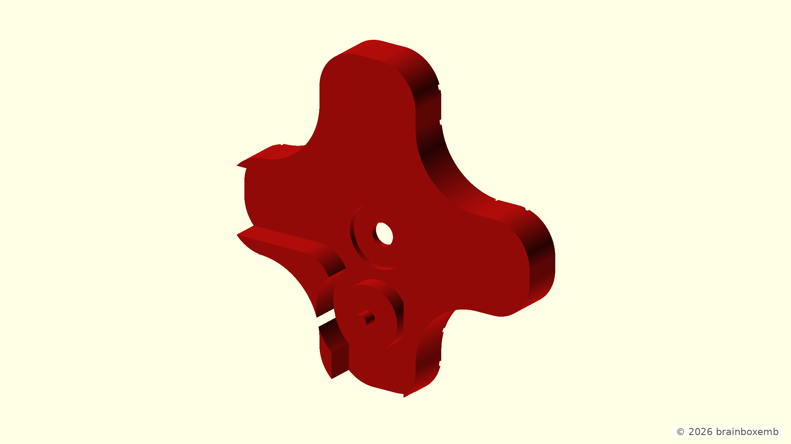

## Front Angled

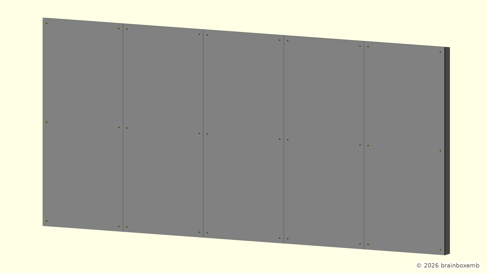

## Front

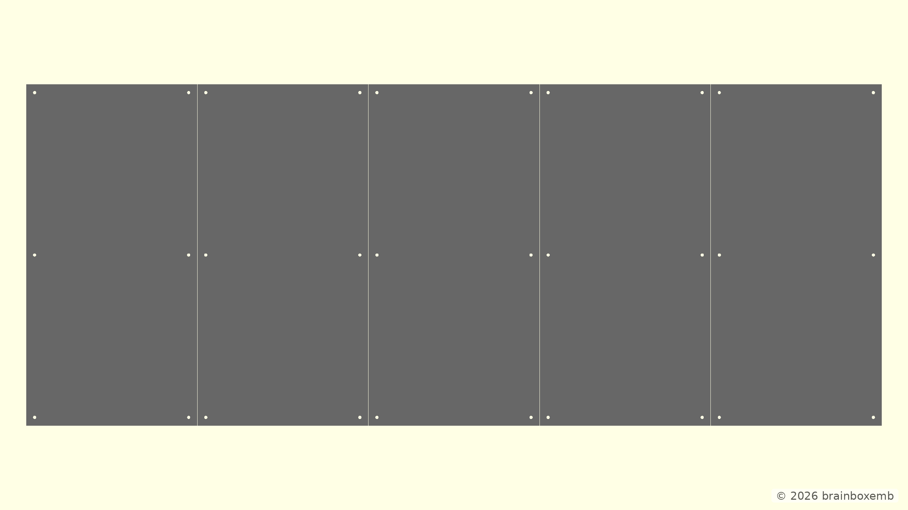

## Horizontal Edge Coupler Large

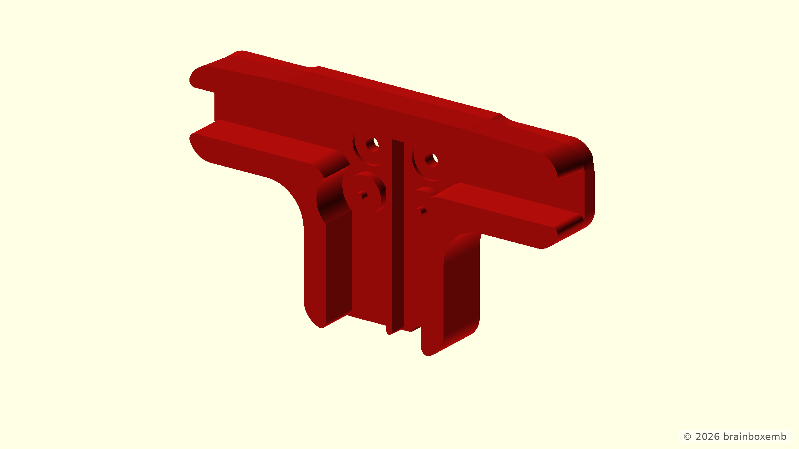

## Horizontal Edge Coupler Medium

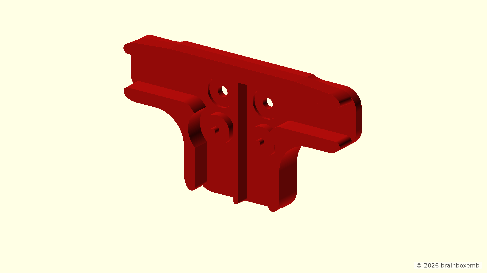

## Horizontal Edge Coupler Small

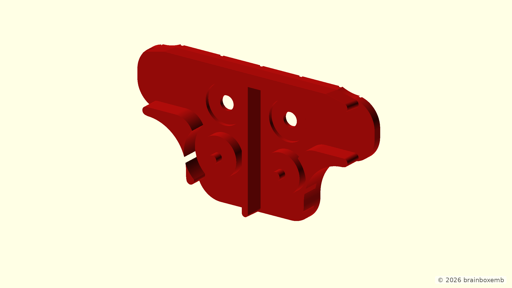

## Middle Coupler Large

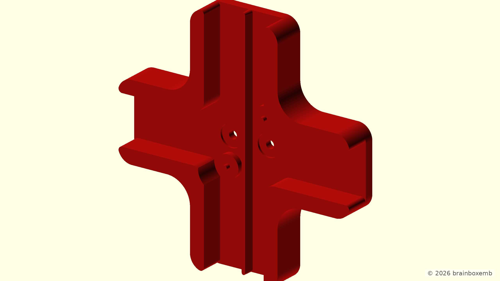

## Middle Coupler Medium

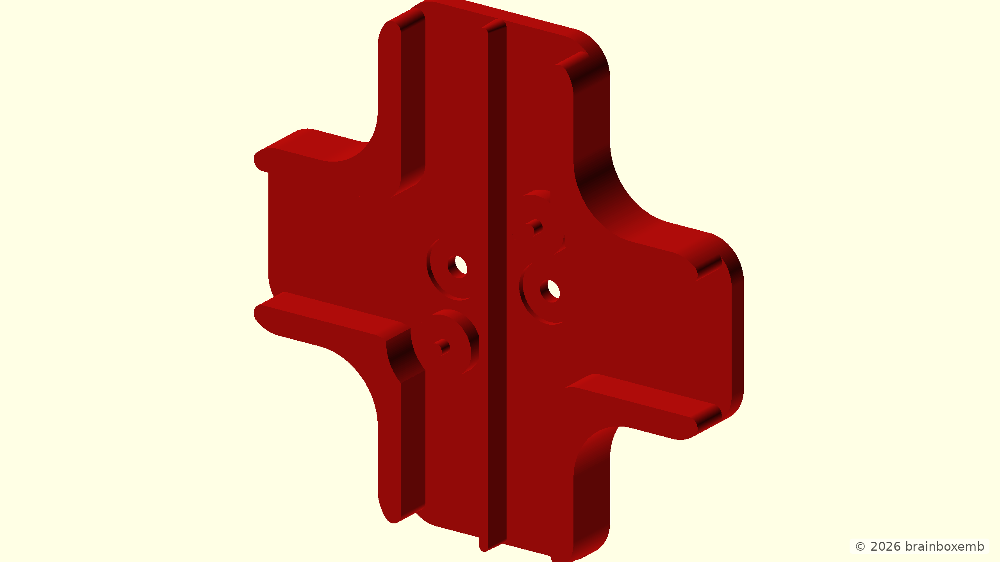

## Middle Coupler Small

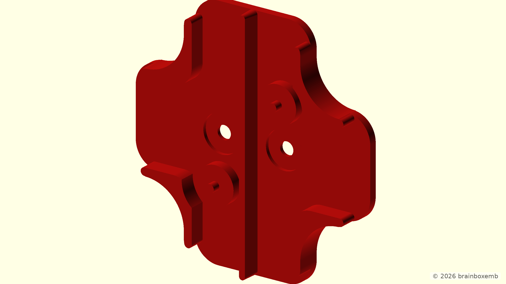

## Rear Angled Couplers

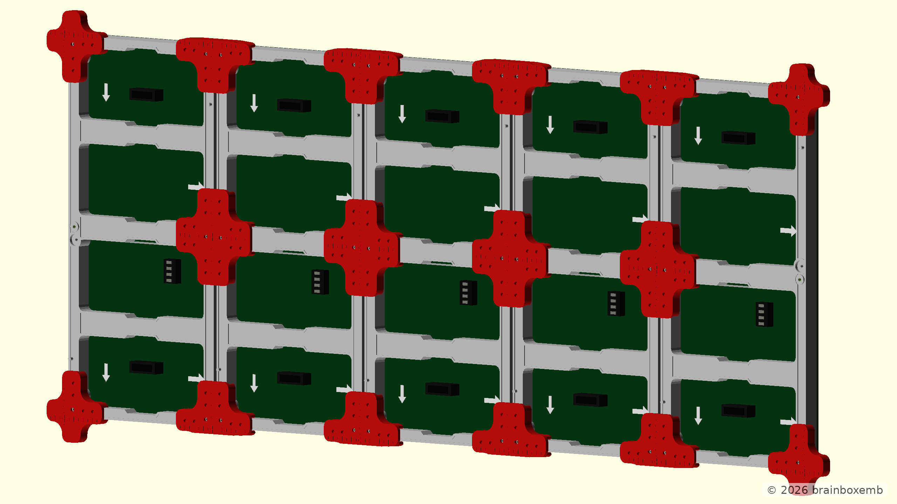

## Rear Angled

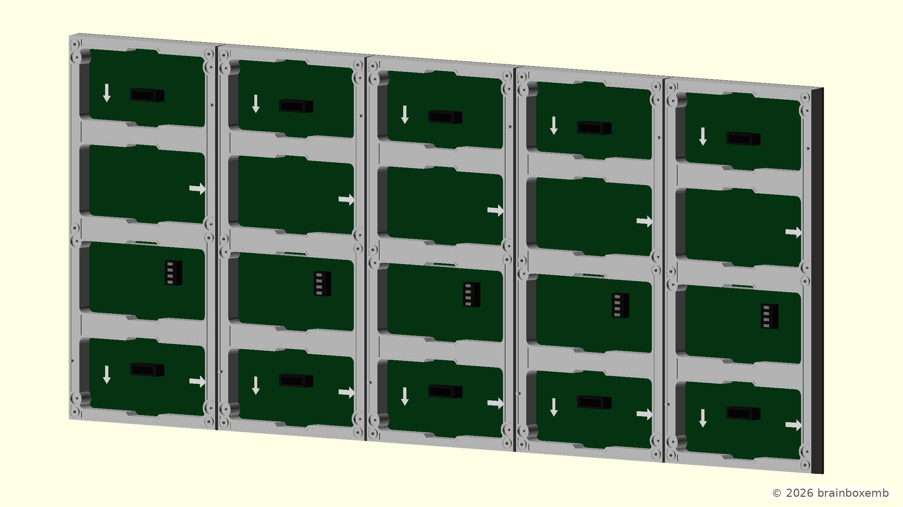

## Rear

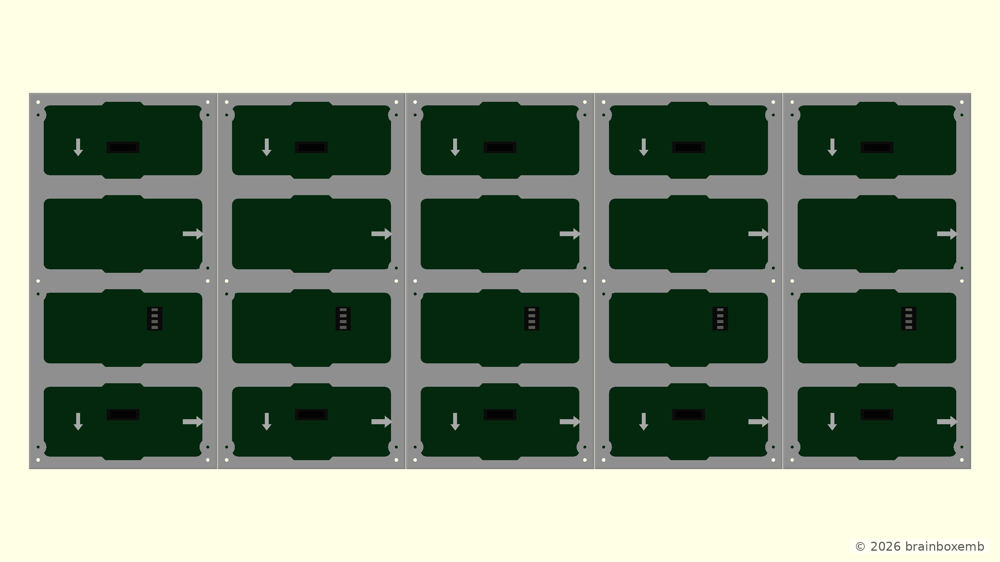
